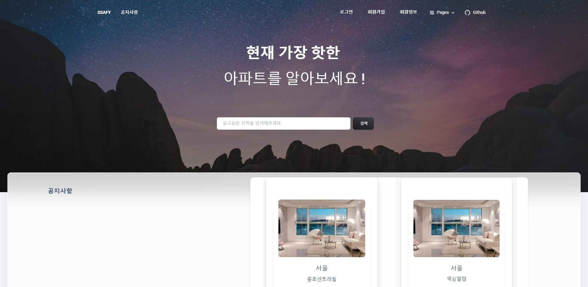
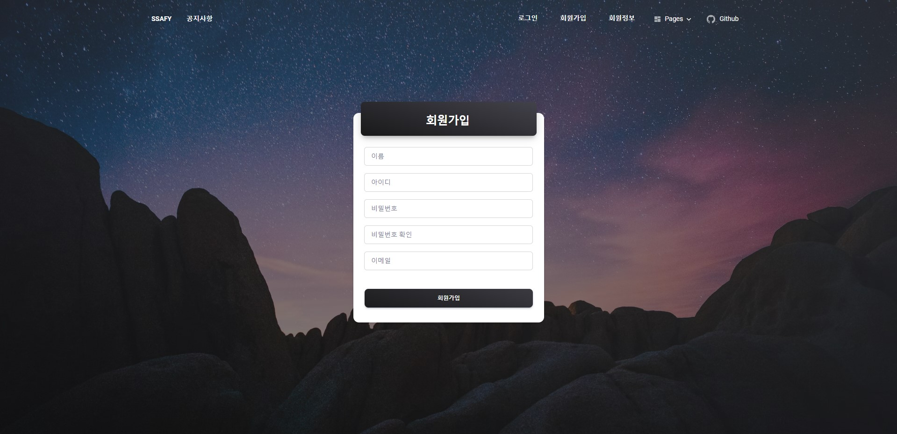
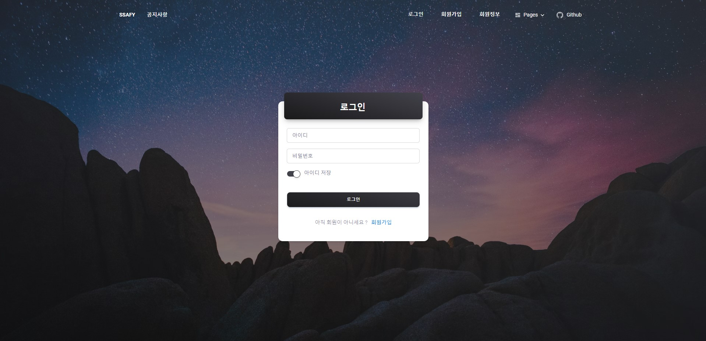
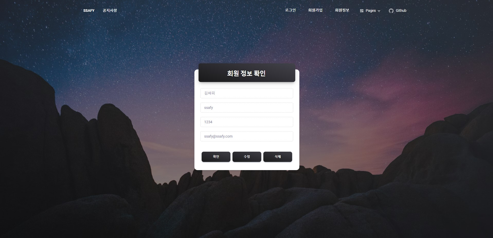
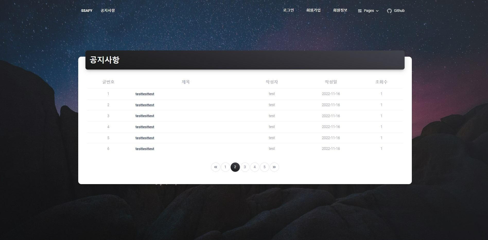
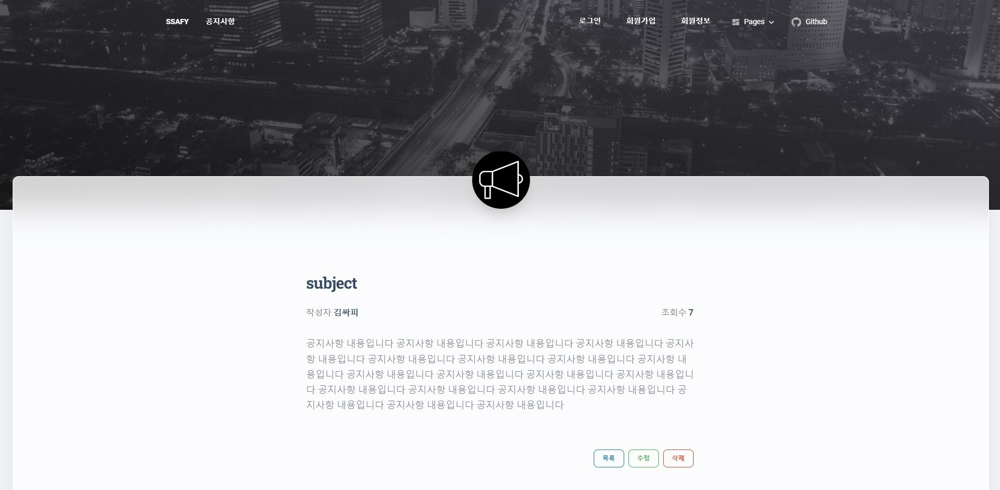
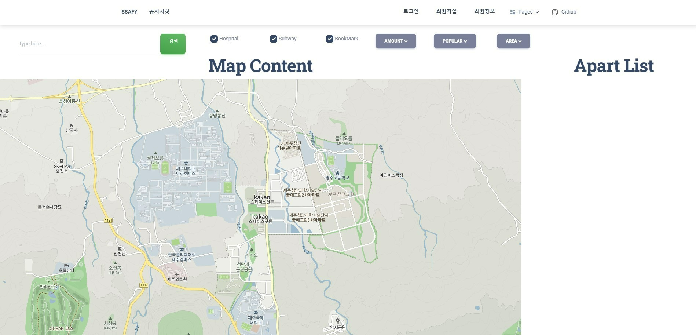

# 구해줘 홈즈(WhereIsMyHome) Project

## [Web Vue PJT]

-   2022 . 11 . 16
-   6조 : 박주희, 조현민

1 . 목표

-   웹 아키텍처를 이해하고 활용할 수 있다.
-   Vue.js를 활용하여 SPA 웹 서버를 구축할 수 있다.
-   MVC 아키텍처를 활용하여 확장성과 유지보수성 좋은 웹 서버를 구축할 수 있다.

2 . 준비사항

-   사용 데이터
    : 국토교통부 아파트/ 연립다세대 실거래가 자료 (제공)

-   개발언어 / 프로그램
    : Java / STS / Tomcat / MySQL / VSCode

-   필수 라이브러리 / 오픈소스
    : Spring Framework / MyBatis Framework / Vue.js / jQuery / Bootstrap

3 . 요구사항

> **이번 관통 프로젝트는 WhereIsMyHome 프로젝트의 Front-End 부분을 Vue.js를 활용하여 SPA로 구현한다.**

4 . 참고화면

## 메인 화면

## 회원 가입 화면

## 로그인 화면

## 회원 정보 확인

## 공지사항

## 공지사항 확인

## 지도 & 아파트 정보 리스트

